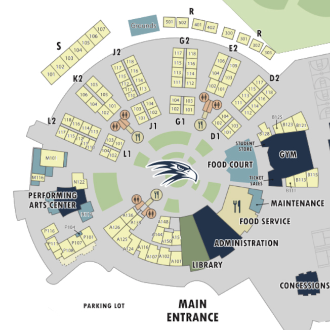

<!-- run on a Github Pages website, using a template from teacher, John Mortensen, on website layout and nothing else -->
<html>

  <!-- visual interface that the user sees -->
  
Enter your class information below and click enter when you are ready.
 
  

  <!-- input cells used for gathering user data -->
    <h3> Period </h3>
        <input autocomplete="off" id='newPeriod' type='number' required>
    <h3> Class </h3>
        <input autocomplete="off" id='newClass' type='text' required>
    <h3> Class Number </h3>
        <select id="dropClass1" required>
          <option value="" selected disabled hidden>---</option>
          <option>A</option>
          <option>B</option>
          <option>D</option>
          <option>E</option>
          <option>G</option>
          <option>J</option>
          <option>K</option>
          <option>L</option>
          <option>M</option>
          <option>N</option>
          <option>P</option>
          <option>R</option>
          <option>S</option>
        </select>
        <select id="dropClass2" required>
          <option value="" selected disabled hidden>---</option>
          <option>101</option>
          <option>102</option>
          <option>103</option>
          <option>104</option>
          <option>105</option>
          <option>106</option>
          <option>107</option>
          <option>108</option>
          <option>110</option>
          <option>111</option>
          <option>112</option>
          <option>113</option>
          <option>114</option>
          <option>115</option>
          <option>116</option>
          <option>117</option>
          <option>118</option>
          <option>121</option>
          <option>122</option>
          <option>123</option>
          <option>124</option>
          <option>125</option>
          <option>126</option>
          <option>128</option>
          <option>136</option>
          <option>138</option>
          <option>144</option>
          <option>148</option>
          <option>150</option>
          <option>151</option>
          <option>300</option>
          <option>301</option>
          <option>302</option>
          <option>303</option>
          <option>401</option>
          <option>402</option>
          <option>501</option>
          <option>502</option>
          <option>Performing Arts Center</option>
          <option>Library</option>
          <option>Administration</option>
          <option>Food Court</option>
          <option>Gym</option>
        </select>
  

  

    <h3> Start Time (hh:mm) </h3>
        <input autocomplete="off" id='newStart' type='time' required>
    <h3> End Time (hh:mm) </h3>
        <input autocomplete="off" id='newEnd' type='time' required>
  

  <!-- submission and clear button used to alter the table state (add or remove data entered by the user) -->
  

    <button class='button' id='addClassButton' onclick="addSchedule()">Add</button>
    <button class='button' id='remove'>Clear</button>
  

  <!-- data table used to display class information entered by the user -->
  

    
Classes

    <table class="table" id="schedule" style="width: 100%; margin-left: auto; margin-right: auto;">
      <tr>
        <th class="cell">Period</th>
        <th class="cell">Class Name</th>
        <th class="cell">Class Number</th>
        <th class="cell">Start Time</th>
        <th class="cell">End Time</th>
      </tr>
    </table>
  

<!-- hidden image used to create map canvas on which classes are marked -->

<!-- canvas on which map and highlighted classes will be displayed -->
<canvas id="canvas" width="652px" height="652px">
</canvas>

<!-- logic of the program -->
