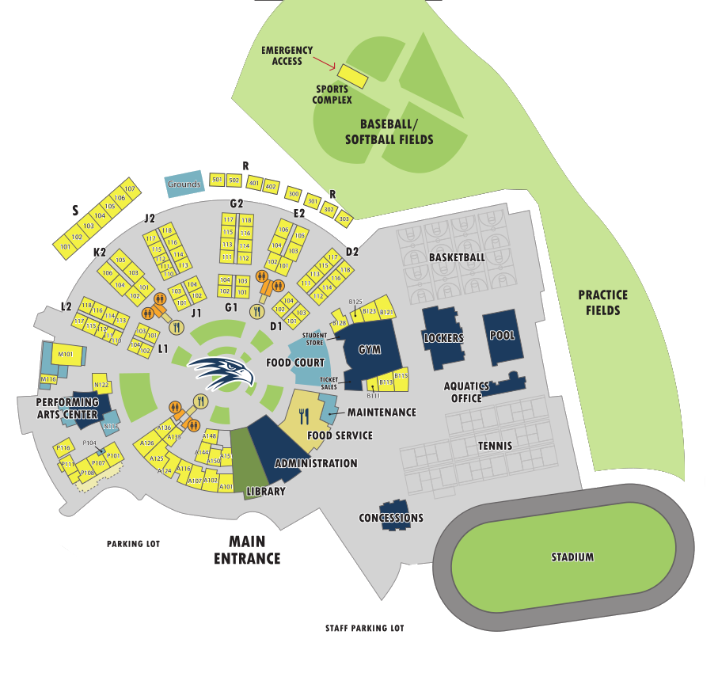

<html>

<form id="addInfo">
  
    
    <h3> Period </h3>
        <input autocomplete="off" id='newPeriod' type='number' required>
    <h3> Class </h3>
        <input autocomplete="off" id='newClass' type='text' required>
    <h3> Class Number </h3>
        <input autocomplete="off" id='classNum' type='text' required>
  

  

    <h3> Start Time (hh:mm) </h3>
        <input autocomplete="off" id='newStart' type='time' required>
    <h3> End Time (hh:mm) </h3>
        <input autocomplete="off" id='newEnd' type='time' required>
  

 
 
<button class='button' id='addClassButton' type="reset" onclick="addTask()">Add</button>
</form>
 
 
<h3 class="title"> Classes </h3>
        <table class="table" id="schedule" style="width: 100%; margin-left: auto; margin-right: auto;">
          <tr>
            <th class="cell">Period</th>
            <th class="cell">Class Name</th>
            <th class="cell">Class Number</th>
            <th class="cell">Start Time</th>
            <th class="cell">End Time</th>
          </tr>
        </table>

<canvas id="canvas" width="652px" height="652px" style="border: 1px solid #000000;">
</canvas>

